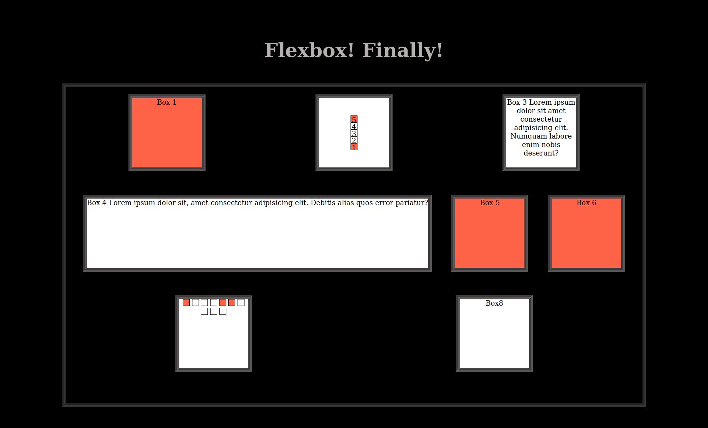

Define a class for our flex container (as we saw today):

- it must display flex obviously
- it must have a border
- add some margin top and bottom
  Create a class for our boxes:
- each side must be 200px long
- give them some borders so that we can distinguish them
- use box-sizing so that border and padding are included in the element width/height
  Note: when you place boxes in containers, make them distinguishable by adding "Box 1", "Box 2", "Box 3", ... as content
  Add 8 boxes to the container

1. Box 3, 4, and 7 must have a 13-words long lorem-ipsum
2. The width of boxes 4 and 7 must adapt to the content (there is a flex-property for this)
3. Color boxes 1, 5 and 6 with a tomato background (using nth-of-type, just for practice...)
4. Boxes 1 and 5 must shrink 2 times faster then the other elements

Optional:

1. Box 6 must shrink 2 times faster than box 1 and 5 (simple mathematics here...)
2. create a new mini-square class
   Side size: 18px including 1px black border on each side
3. Boxes 2 and 7: remove the content in them and place
   5 mini-boxes in box 2 and 10 mini-boxes in box 7
4. Make box 7 display the mini-boxes one next to each other and automatically go on a new line without using flex
5. Box 2 (make it flex): add indexes for the mini-boxes: "1", "2" and so on...
   Make them start from the bottom, go towards the top and wrap on the right side
   Using a rule we saw today, center the boxes horizontally (keep in mind that their direction is vertical)
